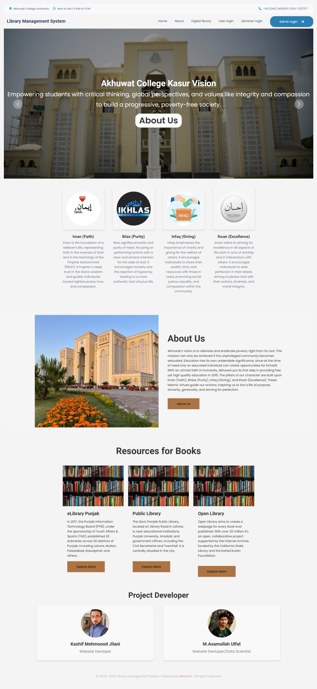

# 📚 Akhuwat Perl's Wisdom Library Management System  

## 📄 Project Summary  

The **Akhuwat Library Management System (ALMS)** is a custom-built, web-based solution developed for **Akhuwat Institute Kasur** to digitalize and streamline library operations.  

Since 2020, the institute’s library—established in collaboration with **Chughtai Lab**—has been operating on the open-source **Koha** platform. While functional, Koha has notable limitations such as:  
- Limited integration and customization options  
- No commercial support  
- Lack of budgeting and audit account features  
- Limited archives management  
- Accessibility issues without internet  
- Complexity for non-technical users  
- Limited vendor support  

To overcome these challenges, **ALMS** was developed with:  
- **Role-Based Access** for Admin, Librarian, and Student/Teacher dashboards  
- **Fine & Audit Management** for transparent record-keeping  
- **Vendor & Archives Management** with efficient tracking  
- **Book Inventory Management** including PDF uploads for digital resources  
- **Offline Accessibility Support**  
- **User-Friendly Interface** for smooth navigation and quick operations  

This system improves library operations, enhances the user experience, and increases resource management efficiency, ensuring both scalability and sustainability for future needs.  

---

## 🚀 Features  
- **User Authentication** – Secure login for admins and librarians with role-based access  
- **Book Management** – Add, update, delete, and search books by title, author, or ISBN  
- **Member Management** – Maintain student and staff borrowing records  
- **Issue & Return** – One-click book transactions with automatic fine calculation  
- **Search Functionality** – Advanced keyword and category-based search  
- **Reports** – Generate usage, fine, and stock reports  
- **Data Backup** – Regular backups to prevent data loss  

---

## 🛠️ Tech Stack  
- **Frontend:** HTML, CSS, JavaScript, Bootstrap  
- **Backend:** PHP  
- **Database:** MySQL  
- **IDE:** Visual Studio Code  
- **Version Control:** GitHub  

---

## 📂 Project Structure  
Akhuwat-Library-Management-System/
│── index.php # Main dashboard
│── login.php # User login page
│── books.php # Book management module
│── members.php # Member management module
│── issue.php # Book issue functionality
│── return.php # Book return functionality
│── reports.php # Reports generation
│── /assets/ # CSS, JS, and images
│── /database/ # MySQL database scripts
│── README.md # Project description

## 🧑‍💻 My Role in Development
- 📊 Designed the **database** (ERD + normalization)  
- ⚙️ Developed **backend functionalities** in PHP  
- 🎨 Created **responsive UI** using Bootstrap  
- 🛠 Performed **testing, debugging, and deployment**  

---

## 🎯 Outcome
- ✅ Implemented at **Akhuwat College Kasur**  
- ⏱ Reduced book issuing/return time by **60%**  
- 📈 Improved accuracy & accessibility of library records  

---

## 📜 License
This project is licensed under the [MIT License](LICENSE).  

---

## 💌 Contact
**Developer:** M.A. Ulfat  
📧 Email: *bazmeulfat786@gamil.com*  
## 📱 Connect with Me  

  
  
  
  
  

 
